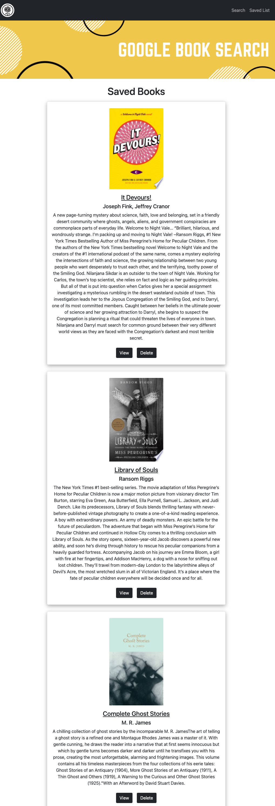
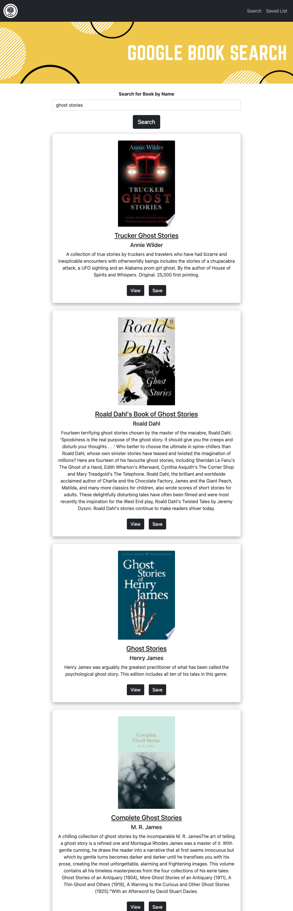

# Google Book Search

## Description
A MERN app for searching for books using the Google Books API and saving books of your choice to a saved list.

## User Story

As a user I want to be able to search for books by title and save books I am interested in to a saved list. If I am no longer interested in a book, I can delete it from my list.

## Table of Contents

* [Installation](#installation)
* [Usage](#usage)
* [Contributing Guidelines](#contributing)
* [License](#license)
* [Questions](#questions)

## Installation

This application was created using the MERN stack. The deployed app can be found at :

## Usage

When the user navigates to the app they are presented with a search bar and invitation to search for books by title. Once a search term is entered, the page will display results on the same page. If the user navigates to the 'saved' pag from the navigation, they will be shown their saved books. If they no longer wish to have a book on their saved list, they can delete it using the provided delete button. Clicking the 'view' button will direct the user to the chosen book's webpage on Google Books.

## Contributing

 

 Link to Contributor's Covenant:[Contributors Covenant](https://www.contributor-covenant.org/version/2/0/code_of_conduct/) 

 
## License

   
Copyright (c) [2021] [Nida Ghuman]

Permission is hereby granted, free of charge, to any person obtaining a copy
of this software and associated documentation files (the "Software"), to deal
in the Software without restriction, including without limitation the rights
to use, copy, modify, merge, publish, distribute, sublicense, and/or sell
copies of the Software, and to permit persons to whom the Software is
furnished to do so, subject to the following conditions:

The above copyright notice and this permission notice shall be included in all
copies or substantial portions of the Software.

THE SOFTWARE IS PROVIDED "AS IS", WITHOUT WARRANTY OF ANY KIND, EXPRESS OR
IMPLIED, INCLUDING BUT NOT LIMITED TO THE WARRANTIES OF MERCHANTABILITY,
FITNESS FOR A PARTICULAR PURPOSE AND NONINFRINGEMENT. IN NO EVENT SHALL THE
AUTHORS OR COPYRIGHT HOLDERS BE LIABLE FOR ANY CLAIM, DAMAGES OR OTHER
LIABILITY, WHETHER IN AN ACTION OF CONTRACT, TORT OR OTHERWISE, ARISING FROM,
OUT OF OR IN CONNECTION WITH THE SOFTWARE OR THE USE OR OTHER DEALINGS IN THE
SOFTWARE. 

## Questions

The repo for this project can be found here: https://github.com/nidaqg/google-book-search

Deployed project can be found at: 

For any questions or to report issues, email me at: nidaqg@gmail.com

